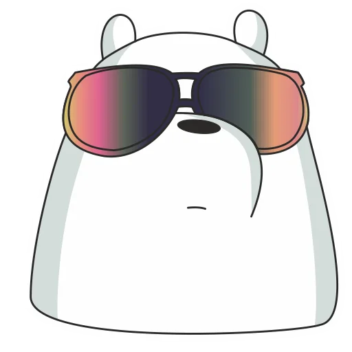

  

### Hi there! I'm Shawn, a Y2 sophomore currently studying Computer Science at the National University of Singapore! 

### I'm interested in anything related to software engineering, product management and artificial intelligence 🤖

### Here are a few projects I've worked on in the past:
- [A simple music player with HTML, CSS and JavaScript](https://shawnnygoh.github.io/Music-Player/)
- [A simple "animated" text gif of one of my favourite memes from The Office](https://shawnnygoh.github.io/Come-To-Life/)
- [A simple personal website made with HTML and CSS](https://shawnnygoh.github.io/)

### Here are the projects I'm currently working on:
- An API Gateway made with the Hertz and Kitex frameworks under CloudWeGo developed by ByteDance

    

